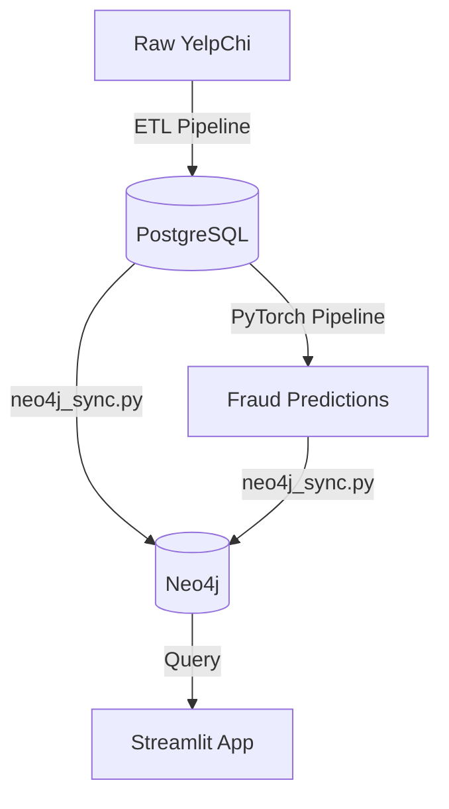
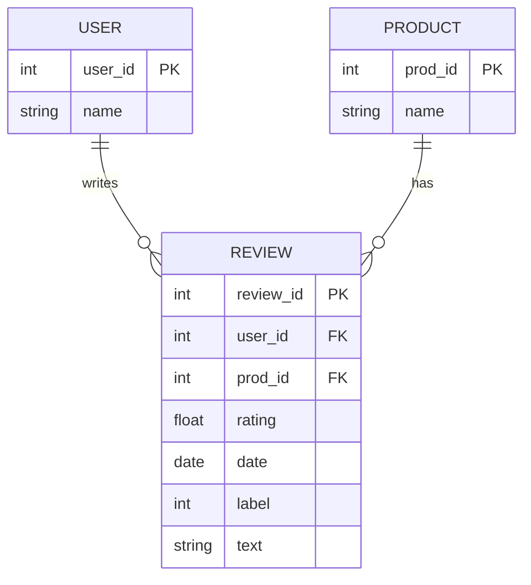
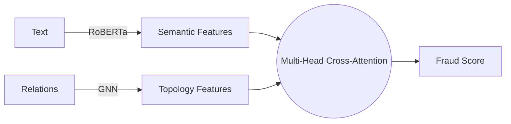
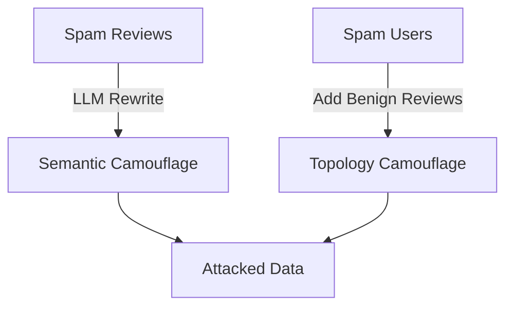

# NeuroGraph-DB Architecture

## System Architecture

## Entity-Relationship Diagram (Postgres)

## Dual-Branch Cross-Attention Model

## Camouflage Attack Pipeline

## Threat Model and Evaluation Protocol

**Attacker Capability:** The attacker can rewrite their own spam text using an LLM (Semantic Camouflage) and can add benign-looking activity or reviews to regular products (Topology Camouflage) to evade detection.
**Out of Scope (NOT modeled):** Creating completely new accounts/nodes on the fly, label flipping, and white-box gradient attacks.

**Evaluation Protocols:**
- **Protocol A (Standard Evaluation):** Train on clean data, test on attacked data.
- **Protocol B (Adversarial Training):** Train on a mix of clean and attacked data, test on attacked data to measure robustness improvements.
