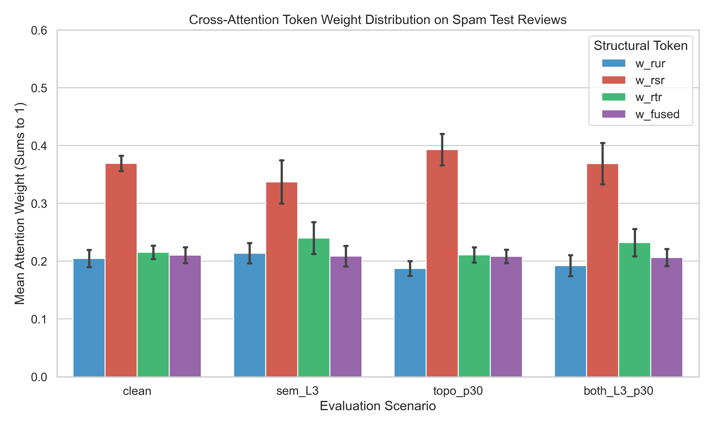

# Cross-Attention Mechanism Analysis

Investigation of cross-attention token weighting $[w_{RUR}, w_{RSR}, w_{RTR}, w_{Fused}]$ for spam reviews under semantic and topology camouflage.

## Mean Attention Weights on Spam Test Set

| Variant | w_RUR | w_RSR | w_RTR | w_Fused |
| :--- | :--- | :--- | :--- | :--- |
| `clean` | 0.2047 ± 0.0149 | 0.3694 ± 0.0132 | 0.2154 ± 0.0114 | 0.2105 ± 0.0135 |
| `sem_L3` | 0.2140 ± 0.0176 | 0.3371 ± 0.0374 | 0.2399 ± 0.0275 | 0.2090 ± 0.0176 |
| `topo_p30` | 0.1874 ± 0.0128 | 0.3932 ± 0.0271 | 0.2109 ± 0.0130 | 0.2085 ± 0.0115 |
| `both_L3_p30` | 0.1926 ± 0.0180 | 0.3689 ± 0.0357 | 0.2321 ± 0.0235 | 0.2064 ± 0.0148 |

## Statistical Hypothesis Testing

- **Hypothesis (Attention Shift on Semantic Camouflage):** When review text is camouflaged (`sem_L3`), cross-attention dynamically adjusts attention toward structural relations.
  - Clean mean `w_fused`: 0.2105
  - `sem_L3` mean `w_fused`: 0.2090
  - Mean paired shift $\Delta w_{fused}$: -0.0015
  - Paired t-test: $t = -1.1943$, $p = 2.3426e-01$
  - Wilcoxon signed-rank test: $W = 4897.0$, $p = 1.5093e-01$

## Attention Visualization

